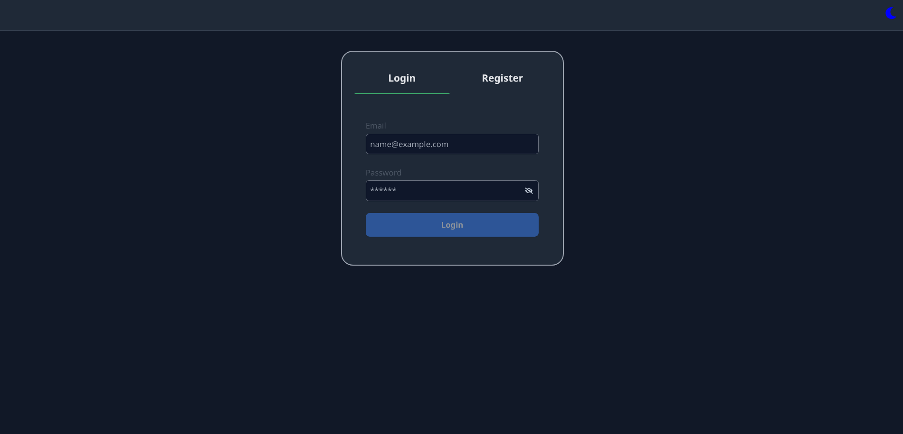
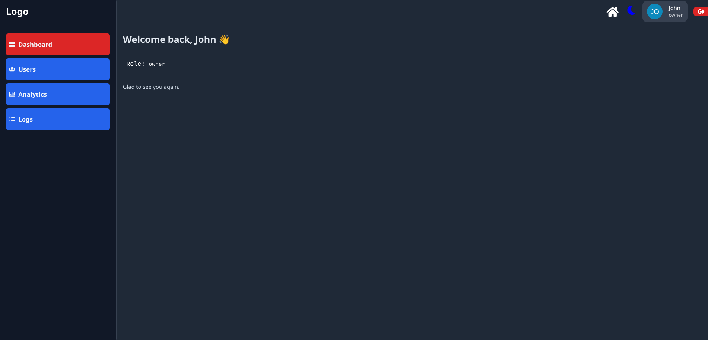
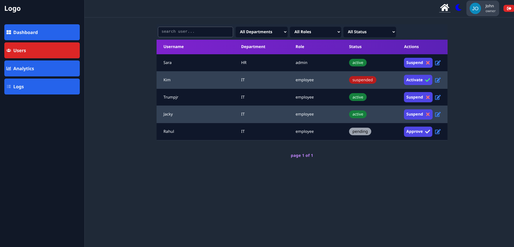
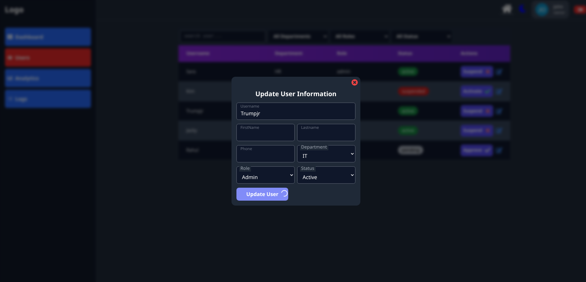
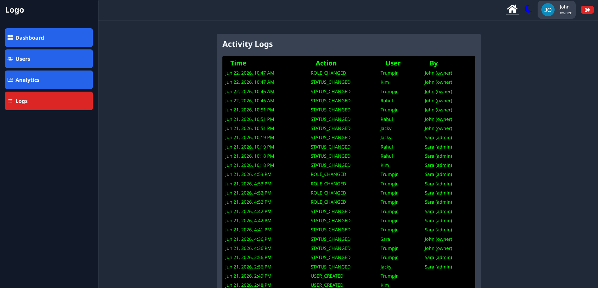

# ManagePanel

A role-based employee management dashboard built with React and Firebase.

ManagePanel simulates a real-world internal administration system where employees, administrators, and owners have different permissions and responsibilities.

---

## Live Demo

https://manageflow-dashboard.vercel.app/

---

## Screenshots

### Login



### Dashboard



### User Management



### Edit User



### Audit Logs



---

## Architecture

- Feature-based folder structure
- Context API for global state management
- Firebase Authentication for user authentication
- Firestore for user and audit log storage
- Role-based route protection

---

## Features

### Authentication

- User registration and login using Firebase Authentication
- Persistent login sessions
- Protected routes

### Role-Based Access Control

#### Employee

- Access personal dashboard
- View profile
- Update profile when account status is Active

#### Admin

- View all users
- Update user information
- Change roles
- Approve users
- Suspend users
- View analytics

#### Owner

- Full Admin permissions
- Access audit logs
- Monitor administrative activities

---

## User Status Management

Users can have one of the following statuses:

- Pending
- Active
- Suspended

Pending employee are restricted from updating profile information until approved.
Pending admin can update own profile but access blocked on users table updation.

---

## User Management

Administrators can:

- View all users
- Edit user information
- Update departments
- Change roles
- Approve registrations
- Suspend accounts

---

## Analytics Dashboard

Dashboard includes:

- Total Users
- Total Employees
- Total Admins
- Total Pending Users
- Total Active Users
- Total Suspended Users

Quick approval section displays pending registrations.

---

## Audit Logging

Owner-only feature.

The system records important administrative actions including:

- User creation
- User deletion
- Status updates
- Role changes
- Department changes

Each log contains:

- Action performed
- Performed by
- Target user
- Timestamp

---

## Tech Stack

### Frontend

- React
- React Router
- Context API
- Tailwind CSS

### Backend & Database

- Firebase Authentication
- Cloud Firestore

### Notifications

- Global notification system built with React Context API
- Success and error feedback for user actions

---

## Project Structure

```txt
src/
├── contexts/
├── firebase/
├── hooks/
├── providers/
├── helpers/
├── router/
├── layouts/
├── pages/
│
├── features/
│   ├── admin/
│   │   ├── components/
│   │   └── services/
│   │
│   ├── owner/
│   │   ├── components/
│   │   └── services/
│   │
│   └── shared/
│       └── components/
```

---

## Future Improvements

- Firebase Security Rules for Backend Validation
- Email Verification


---

## What I Learned

During this project I practiced:

- React component architecture
- Context API state management
- Protected routing
- Firebase Authentication
- Firestore CRUD operations
- Role-based authorization
- Dashboard design patterns
- Audit logging concepts

---

## Local Setup

### 1. Clone the repository

```bash
git clone <repo-url>
cd managepanel
npm install
```

### 2. Create a Firebase Project

- Create a Firebase project
- Enable Authentication (Email/Password)
- Create a Firestore database

### 3. Add Firebase Configuration

Replace the Firebase configuration inside:

```txt
src/firebase/index.js
```

with your own Firebase project configuration.

### 4. Create Firestore Collections

```txt
users
logs
```

### 5. Run the project

```bash
npm run dev
```

## Author

Suhail MSD
